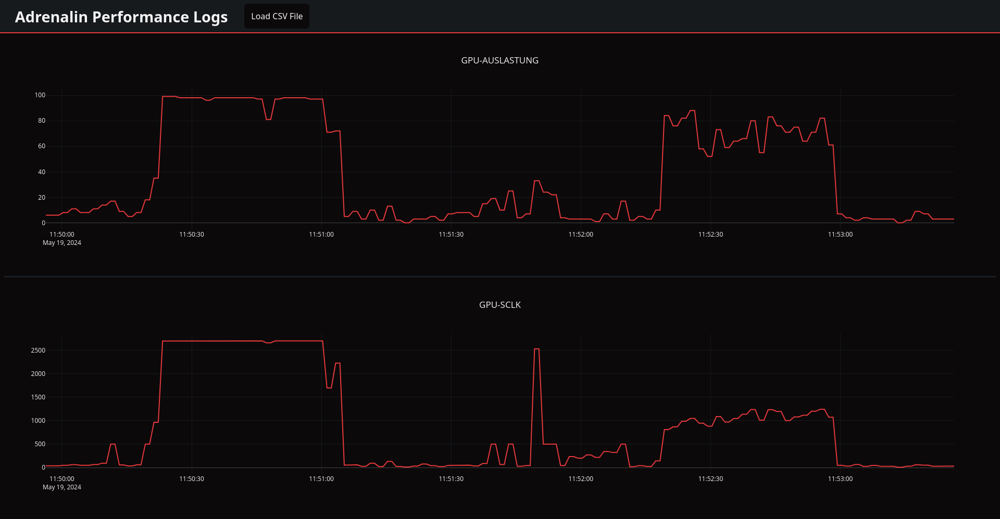

# Adrenalin Performance Log Visualizer

**Adrenalin Performance Log Visualizer** is a simple tool to visulize the performance metrics data recorded by the **AMD Adrenalin** software.

## Usage

After stopping recording performance metrics data, the Adrenaline software outputs the recorded data as CSV files to the specified directory. You can then use this tool to display these files as interactive charts. To do this, use the **Load CSV File** button and select the desired data file whose contents you want to display.

**Adrenalin Performance Log Visualizer** supports both hardware and fps/latency metrics data. By default, the files containing the data are named `Hardware.<TIMESTAMP>.CSV` or `FPS.Latency.<TIMESTAMP>.CSV`.

:warning: Displaying frame time data stored in a file named `<TIMESTAMP>.FrameTime` is not currently supported because it does not contain timestamps.

## Credits

This tool uses the JavaScript version of the open source **[Plotly library](https://github.com/plotly/plotly.js)** to create beautiful and interactive charts.
